# Diagram Patterns

Mermaid templates for common architecture diagrams.

## C4 Model Diagrams

### Level 1: System Context

Shows the system as a single box with users and external systems.

```mermaid
graph TB
    subgraph External
        User[👤 User]
        Admin[👤 Admin]
        ExtPayment[💳 Payment Provider]
        ExtEmail[📧 Email Service]
    end
    
    System[🖥️ Our System]
    
    User -->|Uses| System
    Admin -->|Manages| System
    System -->|Processes payments| ExtPayment
    System -->|Sends emails| ExtEmail
```

### Level 2: Container Diagram

Shows applications, databases, and services within the system.

```mermaid
graph TB
    subgraph Users
        WebUser[👤 Web User]
        MobileUser[📱 Mobile User]
        AdminUser[👤 Admin]
    end
    
    subgraph System [Our System]
        WebApp[🌐 Web App<br/>React SPA]
        MobileApp[📱 Mobile App<br/>React Native]
        API[⚙️ API Service<br/>FastAPI]
        Worker[⚡ Background Worker<br/>Celery]
        DB[(🗄️ Database<br/>PostgreSQL)]
        Cache[(⚡ Cache<br/>Redis)]
        Queue[📬 Message Queue<br/>Redis Pub/Sub]
    end
    
    subgraph External
        Payment[💳 Stripe]
        Email[📧 SendGrid]
        Storage[📁 S3]
    end
    
    WebUser --> WebApp
    MobileUser --> MobileApp
    AdminUser --> WebApp
    
    WebApp --> API
    MobileApp --> API
    
    API --> DB
    API --> Cache
    API --> Queue
    
    Queue --> Worker
    Worker --> DB
    Worker --> Email
    
    API --> Payment
    API --> Storage
```

### Level 3: Component Diagram

Shows internal components of a container. Use sparingly.

---

## Sequence Diagrams

### Basic Request Flow

### Authentication Flow

### Async Processing Flow

### Error Handling Flow

---

## Data Flow Diagrams

### Basic Data Flow

### ETL Pipeline

### Real-time Data Flow

---

## Entity Relationship Diagrams

### Basic ERD

---

## State Diagrams

### Order Status Flow

### User Account States

---

## Deployment Diagrams

### Cloud Architecture

---

## Tips for Good Diagrams

### Do
- Use consistent shapes for same types (databases always cylinders)
- Label connections with what flows through them
- Group related items in subgraphs
- Keep diagrams focused - one concept per diagram
- Use colors sparingly and meaningfully

### Don't
- Cram everything into one diagram
- Use too many crossing lines
- Omit labels on arrows
- Mix abstraction levels
- Include implementation details in high-level diagrams

### Naming Conventions

| Element | Convention | Example |
|---------|------------|---------|
| Services | PascalCase | UserService, PaymentAPI |
| Databases | Name + type | PostgreSQL, Redis Cache |
| Queues | Name + purpose | OrderQueue, EmailQueue |
| External | Provider name | Stripe, SendGrid |
