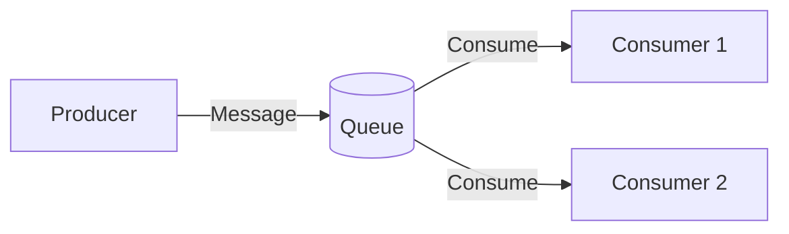
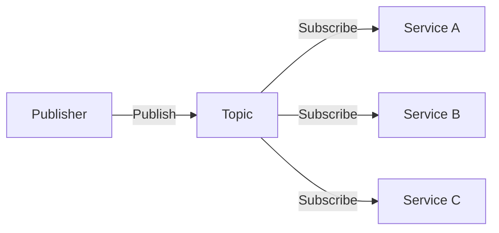
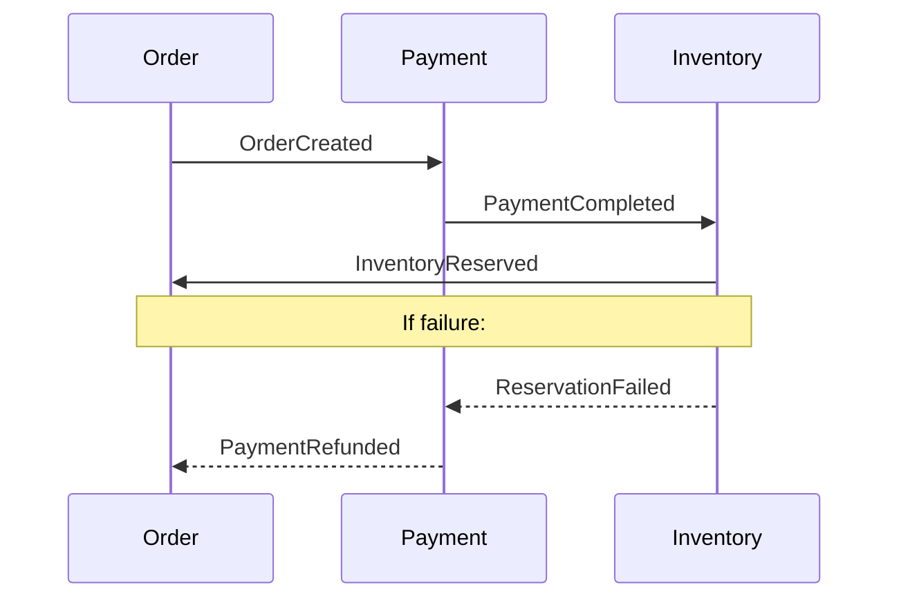
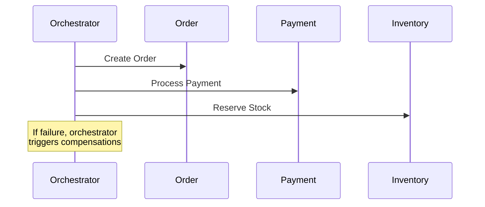

# Integration Patterns

Common patterns for system integration with trade-offs and implementation guidance.

## Pattern Selection Framework

```
┌─────────────────────────────────────────────────────────────────┐
│                    INTEGRATION DECISION TREE                     │
├─────────────────────────────────────────────────────────────────┤
│                                                                  │
│  Need immediate response?                                        │
│  ├── YES → Synchronous (REST, GraphQL, gRPC)                    │
│  └── NO  → Can tolerate delay?                                  │
│            ├── YES → Asynchronous (Queue, Events)               │
│            └── NO  → Hybrid (Sync ack + Async process)          │
│                                                                  │
│  Data volume?                                                    │
│  ├── Low (<100 req/s)  → REST is fine                           │
│  ├── Medium (<1K req/s) → Consider gRPC, batching               │
│  └── High (>1K req/s)   → Event streaming, CQRS                 │
│                                                                  │
│  Coupling tolerance?                                             │
│  ├── Tight OK    → Direct API calls                             │
│  ├── Loose needed → Message queue                                │
│  └── Very loose   → Event-driven                                │
│                                                                  │
└─────────────────────────────────────────────────────────────────┘
```

---

## Synchronous Patterns

### REST API

**When to Use**:
- Standard CRUD operations
- Request-response needed
- Public APIs
- Simple integrations

**Trade-offs**:
| Pros | Cons |
|------|------|
| Simple, well-understood | Tight coupling |
| Great tooling | Chatty for complex queries |
| Cacheable | No real-time updates |
| Stateless | Overfetching/underfetching |

**Implementation Notes**:
```
- Use proper HTTP methods (GET, POST, PUT, PATCH, DELETE)
- Return appropriate status codes
- Version your API (/api/v1/)
- Implement pagination for list endpoints
- Use consistent error format
- Add request timeouts (30s default)
- Implement retries with exponential backoff
```

### GraphQL

**When to Use**:
- Multiple clients with different data needs
- Complex, nested data structures
- Avoiding overfetching
- Rapid frontend iteration

**Trade-offs**:
| Pros | Cons |
|------|------|
| Flexible queries | Complexity |
| Single endpoint | Caching harder |
| Typed schema | N+1 query risk |
| Client specifies data | Security complexity |

**Implementation Notes**:
```
- Use DataLoader to prevent N+1 queries
- Implement query depth limiting
- Add query complexity analysis
- Use persisted queries for production
- Cache at field resolver level
```

### gRPC

**When to Use**:
- Internal service-to-service
- High performance requirements
- Strong typing needed
- Streaming data

**Trade-offs**:
| Pros | Cons |
|------|------|
| High performance | Browser support limited |
| Strong contracts (protobuf) | Learning curve |
| Bi-directional streaming | Debugging harder |
| Code generation | Not human-readable |

**Implementation Notes**:
```
- Use for internal services, REST for public
- Define clear .proto contracts
- Implement proper error codes
- Use deadlines (not timeouts)
- Consider gRPC-web for browser clients
```

---

## Asynchronous Patterns

### Message Queue (Point-to-Point)

**When to Use**:
- Work distribution
- Load leveling
- Guaranteed delivery needed
- Decoupled processing

**Trade-offs**:
| Pros | Cons |
|------|------|
| Reliable delivery | Added complexity |
| Load leveling | Eventual consistency |
| Retry built-in | Ordering challenges |
| Decoupling | Monitoring overhead |

**Implementation Pattern**:


**Implementation Notes**:
```
- Make consumers idempotent
- Use dead letter queues for failed messages
- Implement message deduplication
- Set appropriate visibility timeouts
- Monitor queue depth for scaling
```

### Pub/Sub (Fan-out)

**When to Use**:
- Multiple consumers need same event
- Broadcast notifications
- Event-driven architecture
- Loose coupling between services

**Trade-offs**:
| Pros | Cons |
|------|------|
| Loose coupling | No delivery guarantee* |
| Easy to add consumers | Message ordering |
| Scalable | Duplicate handling |
| Real-time capable | Debugging complexity |

*Depends on implementation

**Implementation Pattern**:


**Implementation Notes**:
```
- Design events as facts (past tense: OrderCreated)
- Include correlation IDs for tracing
- Make subscribers idempotent
- Consider event schema versioning
- Use topic per event type or domain
```

### Event Streaming (Kafka-style)

**When to Use**:
- High throughput requirements
- Event sourcing
- Replayable history needed
- Real-time analytics

**Trade-offs**:
| Pros | Cons |
|------|------|
| High throughput | Operational complexity |
| Replayable | Learning curve |
| Ordered within partition | Cost |
| Long retention | Overkill for simple cases |

**Implementation Notes**:
```
- Partition by entity ID for ordering
- Use consumer groups for scaling
- Set appropriate retention period
- Monitor consumer lag
- Plan for partition rebalancing
```

---

## Hybrid Patterns

### Saga Pattern

**When to Use**:
- Distributed transactions
- Multi-service workflows
- Compensating transactions needed

**Types**:

**Choreography** (Event-driven):


**Orchestration** (Central coordinator):


**Trade-offs**:
| Choreography | Orchestration |
|--------------|---------------|
| Decentralized | Central control |
| Harder to understand flow | Clear workflow |
| No single point of failure | Orchestrator is SPOF |
| Better for simple flows | Better for complex flows |

### CQRS (Command Query Responsibility Segregation)

**When to Use**:
- Read/write patterns very different
- Complex domain with simple queries
- Performance optimization needed
- Event sourcing

**Pattern**:
```mermaid
flowchart TB
    subgraph Commands
        UI1[UI] -->|Write| CommandAPI[Command API]
        CommandAPI -->|Update| WriteDB[(Write DB)]
    end
    
    subgraph Events
        WriteDB -->|Publish| Events[Event Bus]
    end
    
    subgraph Queries
        Events -->|Project| ReadDB[(Read DB)]
        UI2[UI] -->|Read| QueryAPI[Query API]
        QueryAPI -->|Query| ReadDB
    end
```

**Trade-offs**:
| Pros | Cons |
|------|------|
| Optimized read/write | Complexity |
| Scalable | Eventual consistency |
| Flexible projections | Duplicate data |
| Audit trail | Learning curve |

---

## API Gateway Pattern

**When to Use**:
- Multiple backend services
- Common cross-cutting concerns
- Client aggregation needed
- External API exposure

**Responsibilities**:
```
┌─────────────────────────────────────────┐
│              API Gateway                 │
├─────────────────────────────────────────┤
│  • Authentication/Authorization          │
│  • Rate limiting                         │
│  • Request routing                       │
│  • Protocol translation                  │
│  • Response aggregation                  │
│  • Caching                              │
│  • Logging/Monitoring                   │
│  • SSL termination                      │
└─────────────────────────────────────────┘
```

**Implementation Notes**:
```
- Keep gateway stateless
- Don't put business logic in gateway
- Implement circuit breakers
- Add request/response transformation sparingly
- Monitor gateway as critical path
```

---

## Service Mesh Pattern

**When to Use**:
- Many microservices
- Complex traffic management
- Observability requirements
- Security between services

**Capabilities**:
- mTLS between services
- Traffic splitting (canary, blue-green)
- Retry and timeout policies
- Observability (distributed tracing)
- Circuit breaking

**Trade-offs**:
| Pros | Cons |
|------|------|
| Consistent policies | Operational complexity |
| Observability | Resource overhead |
| Security | Learning curve |
| Traffic control | Debugging complexity |

---

## Retry and Circuit Breaker

### Retry Pattern

```python
# Retry configuration
retry_config = {
    "max_attempts": 3,
    "initial_delay_ms": 100,
    "max_delay_ms": 5000,
    "backoff_multiplier": 2,
    "retryable_errors": [
        "connection_timeout",
        "service_unavailable",
        "rate_limited"
    ]
}

# Attempt 1: immediate
# Attempt 2: wait 100ms
# Attempt 3: wait 200ms
# Attempt 4: wait 400ms (if configured)
```

**When to Retry**:
- Network timeouts
- 503 Service Unavailable
- 429 Rate Limited
- Connection refused

**When NOT to Retry**:
- 400 Bad Request (fix input)
- 401/403 Auth errors (fix auth)
- 404 Not Found (resource doesn't exist)
- 409 Conflict (resolve conflict first)

### Circuit Breaker Pattern

```
┌─────────────────────────────────────────────────────────────┐
│                    CIRCUIT BREAKER STATES                    │
├─────────────────────────────────────────────────────────────┤
│                                                              │
│   CLOSED ──────[failures > threshold]──────► OPEN           │
│     │                                          │             │
│     │                                   [timeout elapsed]    │
│     │                                          │             │
│     │                                          ▼             │
│     │◄─────[success]─────── HALF-OPEN ◄────────┘            │
│     │                           │                            │
│     │                      [failure]                         │
│     │                           │                            │
│     │                           ▼                            │
│     │                         OPEN                           │
│                                                              │
└─────────────────────────────────────────────────────────────┘
```

**Configuration**:
```python
circuit_breaker_config = {
    "failure_threshold": 5,      # Failures before opening
    "success_threshold": 3,      # Successes to close from half-open
    "timeout_seconds": 30,       # Time in open before half-open
    "failure_window_seconds": 60 # Window to count failures
}
```

---

## Idempotency

### Why It Matters

```
Client ──[Request]──► Server
Client ◄──[Timeout]───┘ (no response received)

Did it succeed? Client doesn't know.
Client retries. Without idempotency, duplicates occur.
```

### Implementation

**Idempotency Key**:
```http
POST /api/v1/orders
Idempotency-Key: client-generated-uuid-12345
Content-Type: application/json

{"item": "widget", "quantity": 1}
```

**Server Behavior**:
```python
def process_request(idempotency_key, request):
    # Check if we've seen this key
    existing = cache.get(idempotency_key)
    if existing:
        return existing.response  # Return cached response
    
    # Process request
    response = do_work(request)
    
    # Cache response
    cache.set(idempotency_key, response, ttl=24_hours)
    
    return response
```

**Naturally Idempotent Operations**:
- GET, HEAD, OPTIONS (safe methods)
- PUT (replace entire resource)
- DELETE (delete if exists)

**Require Idempotency Key**:
- POST (create)
- PATCH (partial update with side effects)
- Any operation with side effects

---

## Integration Checklist

For each integration, document:

- [ ] **Pattern**: Which pattern and why
- [ ] **Contract**: API spec or event schema
- [ ] **Authentication**: How services authenticate
- [ ] **Error handling**: Retry policy, fallback behavior
- [ ] **Timeouts**: Connection and read timeouts
- [ ] **Circuit breaker**: Thresholds and behavior
- [ ] **Idempotency**: Key strategy if applicable
- [ ] **Monitoring**: Metrics, alerts, dashboards
- [ ] **Testing**: How to test the integration
- [ ] **Runbook**: Troubleshooting steps
